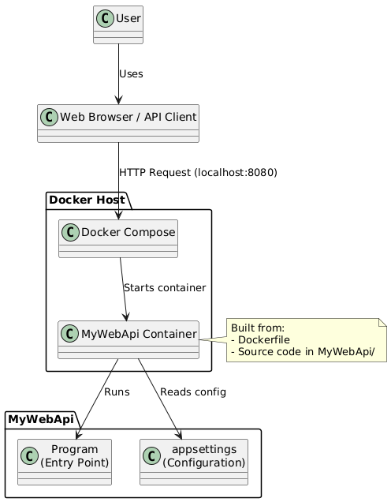
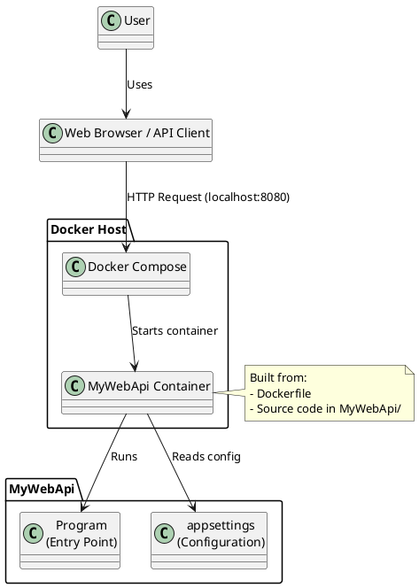
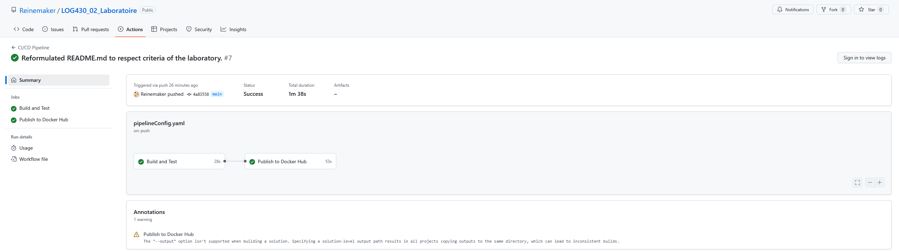

# MyWebApi - ASP.NET Core Web API Project

## Architecture and Project Structure

This project is a minimal ASP.NET Core Web API, designed for educational purposes in the LOG430 - Software Architecture course at École de technologie supérieure. The architecture is simple and container-ready, with CI/CD automation.

**Architecture:**



<details>
<summary>PlantUML Source</summary>


</details>

**Project Structure:**
```
LOG430_02_Laboratoire/
├── MyWebApi/                # Main Web API project
│   ├── Program.cs           # Application entry point
│   └── appsettings.json     # Application configuration
├── MyWebApi.Tests/          # Test project (if present)
├── .github/
│   └── workflows/
│       └── pipelineConfig.yaml # GitHub Actions workflow for CI/CD
├── Dockerfile               # Dockerfile for building the API image
└── docker-compose.yml       # Docker Compose configuration
```

- **MyWebApi/**: Contains the main API code and configuration.
- **MyWebApi.Tests/**: Contains integration/unit tests (if present).
- **.github/workflows/**: Contains the GitHub Actions workflow for CI/CD.
- **Dockerfile**: Used to build the Docker image for the API.
- **docker-compose.yml**: Used to build and run the API container with Docker Compose.

---

## Getting Started

### 1. Clone the Project and Enter the Directory

```bash
git clone https://github.com/Reinemaker/LOG430_02_Laboratoire.git
cd LOG430_02_Laboratoire
```

---

### 2. Build and Launch the Container with Docker Compose

Make sure you have Docker and Docker Compose installed.

```bash
docker compose up --build
```

- This command builds the Docker image for the API using the provided Dockerfile.
- It then starts the container as defined in `docker-compose.yml`.
- The API will be available at [http://localhost:8080](http://localhost:8080).

You can find and pull the image from:

[https://hub.docker.com/r/reinemaker/mywebapi](https://hub.docker.com/r/reinemaker/mywebapi)

To pull the image manually, use:

```bash
docker pull reinemaker/mywebapi:latest
```

---

## CI/CD Pipeline

This project uses **GitHub Actions** for continuous integration and deployment. The pipeline automatically:
- Lints the code using CSharpier
- Builds the project
- Runs unit tests (if present)
- Builds and pushes the Docker image to Docker Hub

The workflow file is located at `.github/workflows/pipelineConfig.yaml`.

### Example: Successful CI/CD Pipeline Execution




Or view the latest runs here:  
[GitHub Actions Runs](https://github.com/Reinemaker/LOG430_02_Laboratoire/actions)

**Direct link to a successful run:**  
[CI/CD Pipeline Run #15104356785](https://github.com/Reinemaker/LOG430_02_Laboratoire/actions/runs/15104356785)

---

## API Endpoint

- **GET /**  
  Returns a "Hello World!" message.

---

## Author

Minjae Lee [LEEM29379701]

---

## License

This project is created for educational purposes.

---

## Acknowledgments

- ASP.NET Core documentation
- GitHub Actions documentation
- Docker documentation
- CSharpier

---

## Technology Choices

The following technologies were selected based on personal experience and modern development practices:

- **ASP.NET (C#)**: Leveraging recent professional experience from a previous internship
- **GitHub Actions**: Utilizing familiar version control platform used throughout academic studies
- **Docker**: Embracing modern containerization technology as a replacement for traditional XAMPP stack